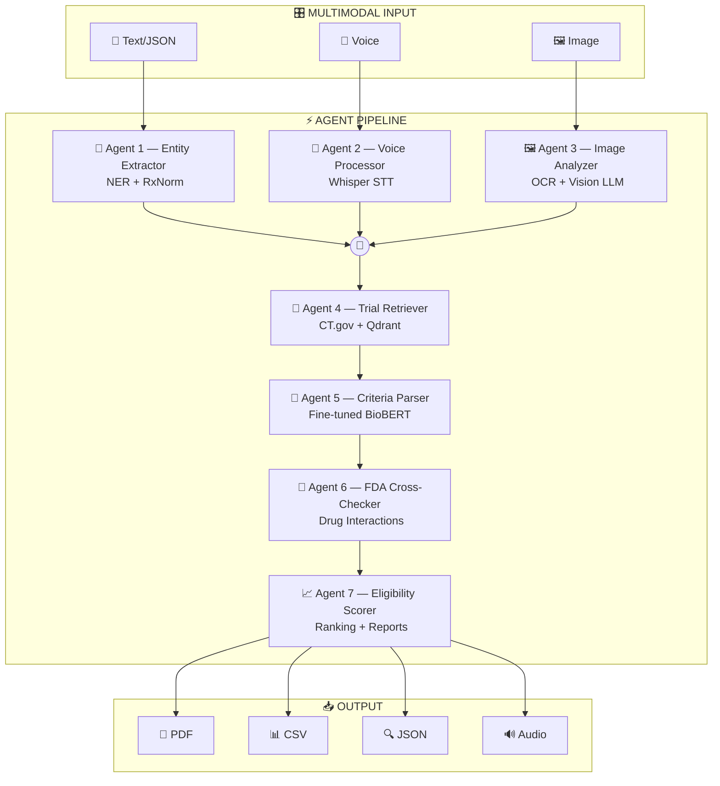

<p align="center">
  
</p>

<h1 align="center">🏥 TrialMatch AI</h1>

<p align="center">
  <strong>Agentic Multi-Modal Clinical Trial Matching System</strong><br/>
  <em>7-agent pipeline · 5 generative AI components · voice + image + text input · live government APIs</em>
</p>

<p align="center">
  
  
  
  
  
  
</p>

<p align="center">
  
  
  
  
  
  
</p>

<p align="center">
  <em>Abhinav Kumar Piyush · NUID 002038671 · Northeastern University · MS in Information Systems · Spring 2026</em>
</p>

---

## 📖 Table of Contents

- [The Problem](#-the-problem)
- [What TrialMatch AI Does](#-what-trialmatch-ai-does)
- [All 5 Core Components](#-all-5-core-components)
- [System Architecture](#-system-architecture)
- [7-Agent Pipeline](#-7-agent-pipeline)
- [Three Operating Modes](#-three-operating-modes)
- [Project Structure](#-project-structure)
- [Quick Start](#-quick-start)
- [Fine-Tuning Workflow](#-fine-tuning-workflow)
- [Multimodal Features](#-multimodal-features)
- [Data Ingestion & Export](#-data-ingestion--export)
- [Evaluation Metrics](#-evaluation-metrics)
- [Tech Stack](#-tech-stack)
- [Ethics & Privacy](#-ethics--privacy)

---

## 🔴 The Problem

Clinical trial matching is broken — not because of bad science, but because humans can't manually cross-reference patient profiles against hundreds of trials with dozens of eligibility criteria each.

| Statistic | Impact |
|-----------|--------|
| **~5%** of adult cancer patients enter clinical trials | Patients miss life-changing treatments |
| **86%** of trials fail to meet enrollment timelines | Research is delayed by years |
| **20%** of trials close due to low enrollment | Promising therapies never get tested |
| **$8M** potential cost per day of trial delay | Billions wasted on enrollment failures |

The patients exist. The trials exist. They just never find each other. It's a **matching problem** hiding inside a healthcare system — and it's exactly the kind of gap where agentic AI can make a real difference.

---

## 🎯 What TrialMatch AI Does

TrialMatch AI takes a patient profile — entered via **text**, **voice dictation**, or **medical image upload** — and runs it through a **7-agent reasoning pipeline** that:

1. **Extracts** medical entities (conditions, biomarkers, medications) and normalizes drug names via RxNorm
2. **Transcribes** voice dictation using Whisper and extracts structured data
3. **Analyzes** medical documents/images using OCR + Vision LLMs
4. **Retrieves** matching trials from ClinicalTrials.gov + Qdrant vector store
5. **Parses** eligibility criteria into structured rules (fine-tuned BioBERT or few-shot LLM)
6. **Cross-checks** medications against OpenFDA drug labels for interactions
7. **Scores** eligibility, generates explanations with citations, and produces downloadable reports

Every recommendation includes a **full audit trail** — criterion-by-criterion reasoning with source citations. The system is designed to **fail loudly** (flagging unevaluated criteria) rather than silently (hiding gaps behind confident scores).

---

## ✅ All 5 Core Components

| # | Component | Implementation | Status |
|---|-----------|---------------|--------|
| 1 | **Prompt Engineering** | Few-shot criteria parsing, multi-agent prompt chains, context management across 7 agents, edge-case handling with coverage tracking | ✅ |
| 2 | **Fine-Tuning** | BioBERT for criteria decomposition + Medical NER for entity extraction. Train on Colab → drop weights into project → app auto-detects | ✅ |
| 3 | **RAG** | Qdrant vector store with configurable chunking + live retrieval from ClinicalTrials.gov, OpenFDA, NCI, RxNorm APIs | ✅ |
| 4 | **Multimodal Integration** | 🎤 Whisper voice-to-text → 🖼️ OCR + Vision LLM image analysis → 🔊 TTS audio summaries. Merge multimodal extractions into unified patient profile | ✅ |
| 5 | **Synthetic Data Generation** | LLM-powered patient profile generator with demographic diversity controls, edge-case injection, quality metrics, HIPAA-free benchmarking | ✅ |

---

## 🏗️ System Architecture

<p align="center">
  
</p>

---

## ⚡ 7-Agent Pipeline



| Agent | Role | Component | Key Technology |
|-------|------|-----------|---------------|
| **Agent 1** | Entity Extractor | Fine-Tuning, Prompt Eng | Fine-tuned NER model or LLM + RxNorm API |
| **Agent 2** | Voice Processor | Multimodal | OpenAI Whisper (local or API) |
| **Agent 3** | Image Analyzer | Multimodal | EasyOCR/Tesseract + Vision LLM (GPT-4o/LLaVA) |
| **Agent 4** | Trial Retriever | RAG | ClinicalTrials.gov v2 API + Qdrant vector search |
| **Agent 5** | Criteria Parser | Fine-Tuning, Prompt Eng | Fine-tuned BioBERT or few-shot prompting |
| **Agent 6** | FDA Cross-Checker | RAG, Prompt Eng | OpenFDA drug label API + interaction logic |
| **Agent 7** | Eligibility Scorer | Prompt Eng | Match scoring + NL explanation generation |

---

## 🔧 Three Operating Modes

| Mode | Requirements | Best For |
|------|-------------|----------|
| 🎯 **Demo Mode** | Nothing — works immediately | Grading, quick demos, offline testing |
| 🦙 **Ollama Mode** | [Ollama](https://ollama.com) installed locally | Development, privacy, free usage |
| 🔑 **API Mode** | OpenAI or Anthropic API key | Production runs, best quality |

**Ollama Mode** connects to your local Ollama instance. Supported models:

| Model | Size | Best For |
|-------|------|----------|
| `mistral` | 4.1 GB | General reasoning, fast |
| `llama3` | 4.7 GB | Strong instruction following |
| `llama3.1` | 4.7 GB | Latest Llama, best quality |
| `gemma2` | 5.4 GB | Google's model, good at structured output |
| `llava` | 4.5 GB | **Required for image analysis in Ollama mode** |

---

## 📂 Project Structure

```
trialmatch-ai/
│
├── app.py                                 # 🏠 Streamlit entry point (dark theme landing)
├── requirements.txt                       # 📦 All dependencies
├── .env.example                           # 🔑 API key template
├── .streamlit/config.toml                 # 🎨 Dark theme configuration
│
├── pages/                                 # 📄 Streamlit multi-page app
│   ├── 1_🔍_Patient_Matching.py           #    Main matching interface + downloads
│   ├── 2_📊_Analytics_Dashboard.py        #    Charts, metrics, model comparisons
│   ├── 3_🧪_Benchmark_Runner.py           #    Evaluation suite runner
│   ├── 4_📁_Data_Ingestion.py             #    API download + local import + indexing
│   ├── 5_🧬_Synthetic_Generator.py        #    Synthetic patient generation
│   └── 6_🎤_Multimodal_Input.py           #    Voice + Image + Audio output
│
├── src/                                   # 🧠 Core source code
│   ├── agents/
│   │   ├── pipeline.py                    #    Orchestrator — chains all 7 agents
│   │   ├── entity_extractor.py            #    Agent 1: Medical NER
│   │   ├── voice_processor.py             #    Agent 2: Whisper STT
│   │   ├── image_analyzer.py              #    Agent 3: OCR + Vision
│   │   ├── trial_retriever.py             #    Agent 4: CT.gov + Qdrant
│   │   ├── criteria_parser.py             #    Agent 5: Criteria decomposition
│   │   ├── cross_checker.py               #    Agent 6: OpenFDA interactions
│   │   └── eligibility_scorer.py          #    Agent 7: Scoring + reports
│   ├── utils/
│   │   ├── llm_router.py                 #    Routes Demo / Ollama / API
│   │   ├── api_clients.py                #    Government API wrappers
│   │   ├── vector_store.py               #    Qdrant embedding & retrieval
│   │   ├── audio_utils.py                #    Whisper + TTS utilities
│   │   ├── image_utils.py                #    OCR + image preprocessing
│   │   ├── report_generator.py           #    PDF / CSV / JSON export
│   │   └── metrics.py                    #    Evaluation metric calculators
│   └── config/
│       ├── settings.py                    #    Mode configs, model paths
│       └── prompts.py                     #    All prompt templates
│
├── data/                                  # 📊 Data files
│   ├── sample_patients/                   #    5 pre-built JSON profiles (demo)
│   ├── sample_trials/                     #    Cached trial data (offline)
│   ├── sample_media/                      #    Sample audio + image files
│   ├── ingested/                          #    Downloaded & indexed trials
│   └── benchmark/                         #    Gold-standard evaluation data
│
├── fine_tuning/                           # 🧠 Fine-tuning (train on Colab)
│   ├── data/
│   │   ├── criteria_parser/               #    Training data (JSONL)
│   │   └── medical_ner/                   #    NER training data (JSONL)
│   ├── scripts/
│   │   ├── train_criteria_parser.ipynb    #    📓 Colab notebook
│   │   ├── train_medical_ner.ipynb        #    📓 Colab notebook
│   │   └── evaluate_models.py             #    Comparison script
│   ├── models/                            #    ⬇️ DROP TRAINED WEIGHTS HERE
│   │   ├── criteria_parser/               #    Unzip Colab output
│   │   └── medical_ner/                   #    Unzip Colab output
│   └── results/                           #    Training logs & charts
│
└── assets/                                # 🖼️ Architecture diagrams
    ├── architecture.svg                   #    System architecture diagram
    └── pipeline_flow.md                   #    Mermaid pipeline diagram
```

---

## 🚀 Quick Start

### Prerequisites

- Python 3.10+
- [Ollama](https://ollama.com) installed (for Ollama mode)

### 1. Clone & Install

```bash
git clone https://github.com/yourusername/trialmatch-ai.git
cd trialmatch-ai
pip install -r requirements.txt
```

### 2. Demo Mode — zero setup, works immediately

```bash
streamlit run app.py
# → Select "🎯 Demo Mode" in sidebar
# → Everything works with pre-loaded data, no API keys needed
```

### 3. Ollama Mode — local LLM, free

```bash
# Pull models (one-time)
ollama pull mistral        # For text reasoning
ollama pull llava          # For image analysis (optional)

# Run
streamlit run app.py
# → Select "🦙 Ollama Mode" in sidebar
# → Pick your model (mistral, llama3, etc.)
```

> **Yes, Ollama mode works with your local Ollama installation.** The app connects to `http://localhost:11434` by default. If you're running Ollama on a different port, update it in the sidebar.

### 4. API Mode — full power

```bash
cp .env.example .env
# Edit .env → add your OpenAI or Anthropic API key

streamlit run app.py
# → Select "🔑 API Mode" in sidebar
```

---

## 🧠 Fine-Tuning Workflow

Fine-tuning is **optional** — the app works without it by falling back to LLM-based extraction. But fine-tuned models are faster (14x) and free at inference.

### Model 1: Criteria Parser (BioBERT)

```
1. Review:    fine_tuning/data/criteria_parser/train.jsonl
2. Upload:    fine_tuning/scripts/train_criteria_parser.ipynb → Google Colab
3. Train:     Run all cells (uses free T4 GPU)
4. Download:  criteria_parser_v1.zip
5. Place:     Unzip → fine_tuning/models/criteria_parser/
6. Done:      App auto-detects model in sidebar dropdown
```

### Model 2: Medical NER

```
1. Review:    fine_tuning/data/medical_ner/train.jsonl
2. Upload:    fine_tuning/scripts/train_medical_ner.ipynb → Google Colab
3. Train:     Run all cells
4. Download:  medical_ner_v1.zip
5. Place:     Unzip → fine_tuning/models/medical_ner/
6. Done:      App auto-detects model in sidebar dropdown
```

### What the app expects in each model folder

```
fine_tuning/models/criteria_parser/
├── config.json              ← Required (app scans for this)
├── model.safetensors        ← Weights
├── tokenizer.json           
├── tokenizer_config.json    
├── special_tokens_map.json  
└── training_metrics.json    ← Optional (for dashboard)
```

---

## 🎤 Multimodal Features

### Voice Input (Whisper)

- Upload `.wav`, `.mp3`, `.m4a`, `.ogg`, `.flac` audio files
- Or record directly in the browser (requires `streamlit-audiorec`)
- Whisper transcribes → LLM extracts structured medical entities
- Entities merge with any existing patient profile data

### Image / Document Input (OCR + Vision)

- Upload lab reports, pathology reports, prescriptions (`.png`, `.jpg`, `.pdf`)
- EasyOCR / Tesseract extracts text
- Vision LLM (GPT-4o in API mode, LLaVA in Ollama mode) interprets document structure
- Extracts lab values, biomarkers, medications into structured format

### Audio Output (TTS)

- Generates spoken summary of matching results
- Downloadable as `.mp3`
- Uses gTTS (free) or OpenAI TTS API

---

## 📁 Data Ingestion & Export

### Ingestion (Input)

| Method | Description |
|--------|-------------|
| **API Download** | Bulk-fetch trials from ClinicalTrials.gov v2 API by condition, phase, status |
| **Local Import** | Upload CSV/JSON/JSONL files of trial data |
| **Vector Index** | Embed trial criteria into Qdrant with configurable chunking strategy |

### Export (Output)

| Format | Contents |
|--------|----------|
| **📄 PDF Report** | Ranked trial list, match scores, criterion-by-criterion reasoning |
| **📊 CSV** | Tabular results for spreadsheet analysis |
| **🔍 JSON Audit Trail** | Full pipeline trace — every agent's input/output/timestamps |
| **🔊 Audio Summary** | Spoken overview of top matches (TTS) |

---

## 📊 Evaluation Metrics

| Metric | Target | What It Measures |
|--------|--------|-----------------|
| **Retrieval Recall** | ≥ 85% | Of all truly eligible trials, how many did we find? |
| **Retrieval Precision** | ≥ 75% | Of returned trials, how many were actually eligible? |
| **F₂ Score** | — | Recall-weighted harmonic mean (β=2, because missing a match is worse than a false alarm) |
| **Exclusion Accuracy** | ≥ 90% | When the system says "excluded by Criterion X," is that correct? |
| **Faithfulness** | ≥ 0.85 | Does the NL explanation match the structured reasoning trace? (LLM-as-Judge) |
| **Criterion Coverage** | ≥ 70% | What % of criteria were actually evaluated vs skipped? |
| **Voice WER** | ≤ 15% | Word Error Rate on medical voice dictation |
| **Image OCR Accuracy** | ≥ 90% | Correct field extraction from lab report images |

---

## 🛠️ Tech Stack

### Core Framework
| Technology | Purpose |
|-----------|---------|
|  | Core language |
|  | Frontend (dark theme, multi-page) |
|  | Interactive charts & visualizations |

### LLM & AI
| Technology | Purpose |
|-----------|---------|
|  | Local LLM inference (Mistral, Llama3, LLaVA) |
|  | GPT-4o for reasoning + Whisper for voice |
|  | Claude Sonnet for reasoning |
|  | Agent orchestration framework |

### Fine-Tuning
| Technology | Purpose |
|-----------|---------|
|  | Transformers, Datasets, Evaluate |
|  | Model training backend |
|  | Free GPU training environment |

### RAG & Data
| Technology | Purpose |
|-----------|---------|
|  | Vector store for trial embeddings |
| `sentence-transformers` | Embedding generation (MiniLM / PubMedBERT) |
| ClinicalTrials.gov v2 API | Trial metadata, eligibility criteria |
| OpenFDA API | Drug labels, interactions, FAERS |
| NCI Cancer Trials API | Biomarker-enriched oncology trials |
| RxNorm (NLM) | Drug name normalization |

### Multimodal
| Technology | Purpose |
|-----------|---------|
|  | Speech-to-text (local or API) |
| `easyocr` / `pytesseract` | OCR for medical documents |
| `gTTS` | Text-to-speech for audio summaries |
| GPT-4o Vision / LLaVA | Medical document understanding |

---

## 🔒 Ethics & Privacy

- **Zero real patient data** — all profiles are synthetic (HIPAA-safe)
- **All APIs are public/government-maintained** — no proprietary data, no scraping
- **Patient data never leaves local machine** — only condition-level queries hit external APIs
- **Diversity tracking** — system surfaces trial diversity data, never filters on demographics
- **Transparent reasoning** — every match/exclusion cites the exact criterion + data source
- **Fail-loud design** — unevaluated criteria are flagged as `⚠️ NOT EVALUATED`, not hidden

---

## 📝 License

This project is for academic purposes as part of the Generative AI course at Northeastern University.

---

<p align="center">
  <strong>TrialMatch AI</strong> · Built with ❤️ by Abhinav Kumar Piyush · NUID 002038671<br/>
  Northeastern University · MS in Information Systems · Spring 2026
</p>
