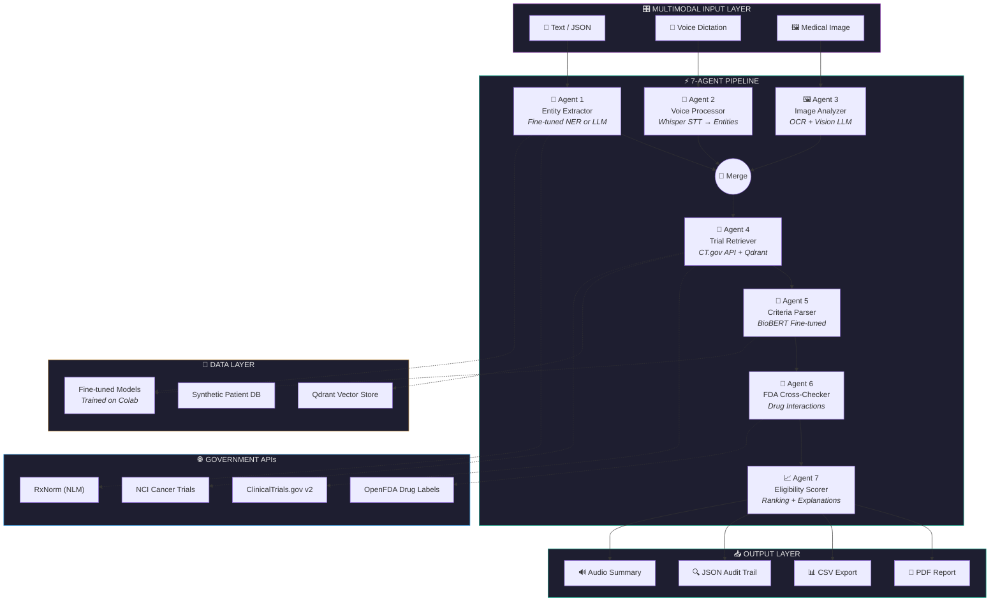

```mermaid
flowchart TB
    subgraph INPUT["🎛️ MULTIMODAL INPUT LAYER"]
        direction LR
        TXT["📝 Text / JSON"]
        VOICE["🎤 Voice Dictation"]
        IMG["🖼️ Medical Image"]
    end

    subgraph AGENTS["⚡ 7-AGENT PIPELINE"]
        A1["🔬 Agent 1<br/>Entity Extractor<br/><i>Fine-tuned NER or LLM</i>"]
        A2["🎤 Agent 2<br/>Voice Processor<br/><i>Whisper STT → Entities</i>"]
        A3["🖼️ Agent 3<br/>Image Analyzer<br/><i>OCR + Vision LLM</i>"]
        MERGE(("🔀 Merge"))
        A4["🔎 Agent 4<br/>Trial Retriever<br/><i>CT.gov API + Qdrant</i>"]
        A5["📝 Agent 5<br/>Criteria Parser<br/><i>BioBERT Fine-tuned</i>"]
        A6["💊 Agent 6<br/>FDA Cross-Checker<br/><i>Drug Interactions</i>"]
        A7["📈 Agent 7<br/>Eligibility Scorer<br/><i>Ranking + Explanations</i>"]
    end

    subgraph APIS["🌐 GOVERNMENT APIs"]
        CT["ClinicalTrials.gov v2"]
        FDA["OpenFDA Drug Labels"]
        NCI["NCI Cancer Trials"]
        RX["RxNorm (NLM)"]
    end

    subgraph DATA["💾 DATA LAYER"]
        QD["Qdrant Vector Store"]
        SYN["Synthetic Patient DB"]
        FT["Fine-tuned Models<br/><i>Trained on Colab</i>"]
    end

    subgraph OUTPUT["📥 OUTPUT LAYER"]
        PDF["📄 PDF Report"]
        CSV["📊 CSV Export"]
        JSON["🔍 JSON Audit Trail"]
        AUDIO["🔊 Audio Summary"]
    end

    TXT --> A1
    VOICE --> A2
    IMG --> A3
    A1 --> MERGE
    A2 --> MERGE
    A3 --> MERGE
    MERGE --> A4
    A4 --> A5
    A5 --> A6
    A6 --> A7

    A4 -.-> CT
    A4 -.-> QD
    A6 -.-> FDA
    A1 -.-> RX
    A1 -.-> FT
    A5 -.-> FT
    A4 -.-> NCI

    A7 --> PDF
    A7 --> CSV
    A7 --> JSON
    A7 --> AUDIO

    style INPUT fill:#1e1e30,stroke:#8e44ad,color:#e0e0e0
    style AGENTS fill:#1e1e30,stroke:#16a085,color:#e0e0e0
    style APIS fill:#1e1e30,stroke:#3498db,color:#e0e0e0
    style DATA fill:#1e1e30,stroke:#d4a053,color:#e0e0e0
    style OUTPUT fill:#1e1e30,stroke:#16a085,color:#e0e0e0
```
